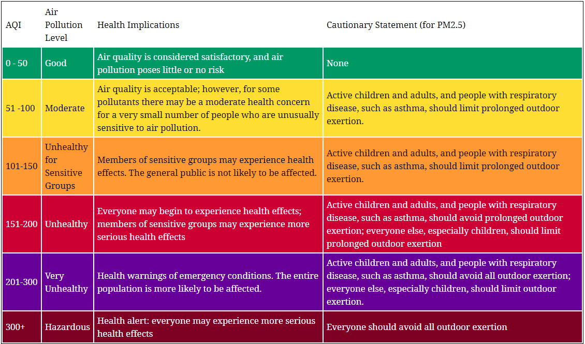

# **KAFKA APPLICATION WITH POLLUTION DATAS**

 

## Available streams
***
+  AQI (Air quality Index) per city. Here is the indice definition :
 
    

## Available topics
***
+  *pollution-stats-raw* : raw datas
+  *pollution-per-city* : air quality index by city

## Running the application
***
+  All should be parametrable from [KafkaConfig.java](./src/main/java/config/KafkaConfig.java).

+  If you are on docker toolbox (generally on windows), don't use localhost:9092 as broker but 192.168.99.100:9092 in [KafkaConfig.java](./src/main/java/config/KafkaConfig.java) and same in [docker-compose file](./src/main/docker-compose.yml).

+  You have to create *.env* file in [src/main/java](./src/main/java) and put your api key.
    > API_KEY=xxxxxxxxxx 

   If you don't have api key, You can get one on https://aqicn.org/data-platform/token/#/

+  To launch the application, run docker-compose up. 

+  You need to run the [Kafka producer](./src/main/java/collection/producer/Starter.java) to request datas from Api. 

+  If you want to check the raw datas, run [Kafka consumer](./src/main/java/collection/consumer/RawDataConsumerUtils.java) if you want to display datas in real time in console. Or you can see them on the UI.

+  If you want to get streams, other than the raw one, run producers in [analysis](./src/main/java/analysis) folder. You can check streams on the UI or running the corresponding consumers to display streams in console.

+  The UI is accessible on *192.168.99.100:3030* or *localhost:3030*.

